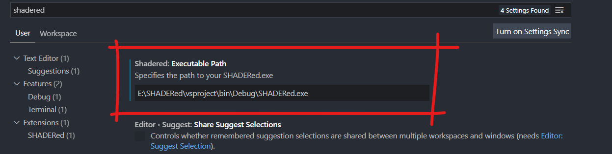
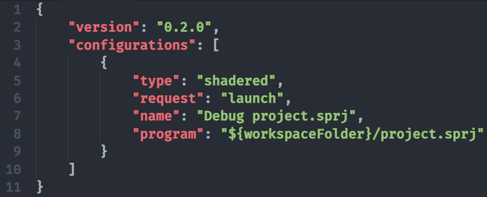
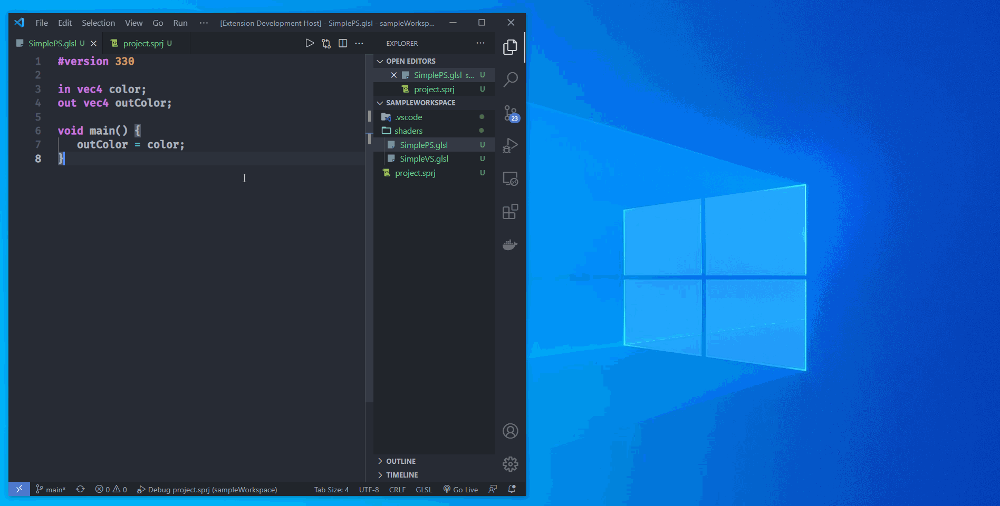
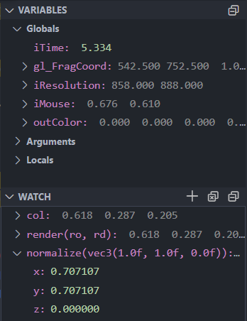
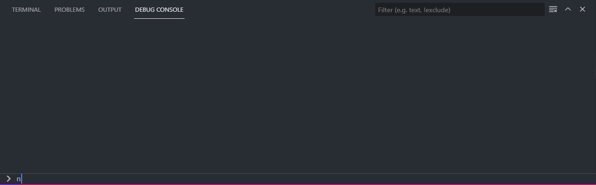
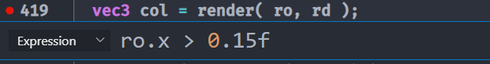
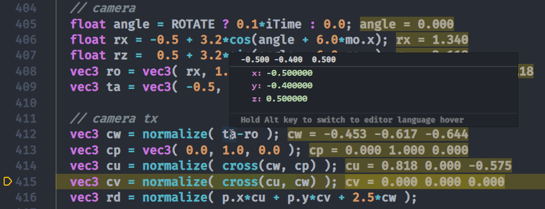
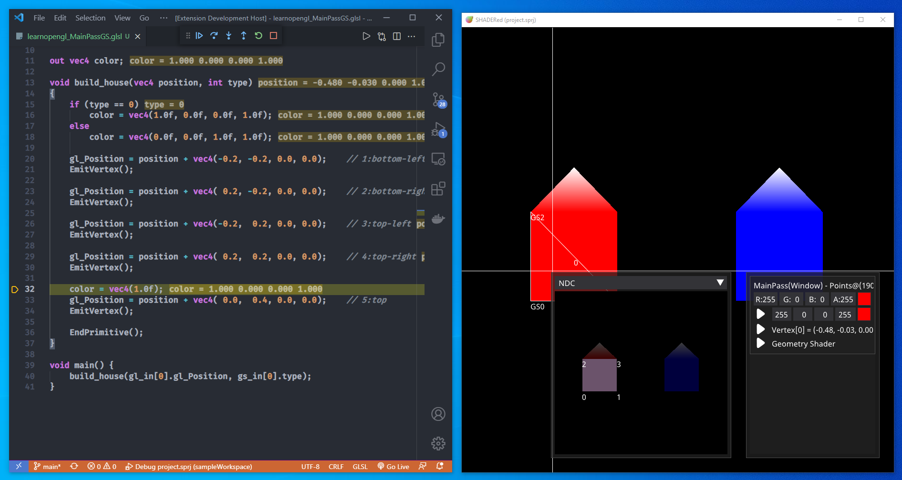

# vscode-shadered
This extension lets you debug and preview HLSL & GLSL shaders in Visual Studio Code.

## How to use
After you install the extension, you need to tell VS Code the location of your SHADERed executable (you have to have [SHADERed downloaded](https://shadered.org) for this extension to work!).
You can do this by going to the settings (`File` &rarr; `Preferences` &rarr; `Settings`) and searching for "shadered".
A textbox will appear where you have to enter the path to your SHADERed executable.



Now that VS Code knows the location of SHADERed, open a directory/workspace which contains a SHADERed project file (`.sprj`).
To start the debugger, either open the `.sprj` file in the text editor or
add the `.vscode/launch.json` file to your workspace with the following [code](https://github.com/dfranx/vscode-shadered/blob/master/sampleWorkspace/.vscode/launch.json):



and then press the F5 key.
Without the `launch.json` file, you will always have to change focus to the `.sprj` file in VS Code before you press the F5 key.

## Features
### Debugging HLSL & GLSL shaders
With this extension you can debug both HLSL and GLSL shaders.
Once you've opened your project, select a pixel by clicking on it.
SHADERed will pause the preview and you will be able to pick the shader stage that you'd like to debug.
You can debug vertex, pixel, geometry, compute & tessellation control shaders.
To start the actual debugger, click on the "play" button. You will now be able to:

* step through your shader line-by-line
* see variable values
* run immediate expressions
* place (conditional) breakpoints
* add watches
* etc... 


Besides debugging, you can also see your shader's output as you edit the code.
When you save your changes to a file, SHADERed will automatically detect them and recompile the shaders.



### Watches
You can add watches through Visual Studio Code's user interface.
Watches will tell you the value of your expression.
The value will be updated as you step through your shader's code.
You can also see list of all variables and their values.



### Run immediate expressions
If you want to see the result of an expression without having to add it as a watch, you can enter the custom expressions in VS Code's `Debug Console` window.



### Breakpoints
You can add breakpoints to your shaders.
The debugger will pause the execution when it hits the breakpoint.
These breakpoints can also have a condition (the debugger will only pause when the condition has been met)



### Inline values & hover
If you've got the `"debug.inlineValues"` option turned on, VS Code will show variable values next to the each line.
You can also hover over a variable's name to see it's value.



### Debugging geometry shaders
Besides vertex and pixel shaders, you can also debug geometry shaders. A window showing GS output will open when you start the geometry shader debugger.



### Debugging compute shaders
Debugging compute shaders with this extension is somewhat limited. There's currently no way to start debugging a specific thread (though, this can be done through standalone SHADERed). You can only initiate the CS debugger through the so-called "suggestions" (these suggestions are predictions made by SHADERed):


## Build
If you want to compile this extension by yourself, run these commands:
```sh
git clone https://github.com/dfranx/vscode-shadered.git
cd vscode-shadered
npm install
```

Open project's directory with VS Code and hit `F5` key -- a new VS Code window will open and you'll be able to test the extension there.

## LICENSE
vscode-shadered is licensed under MIT license. See [LICENSE](./LICENSE) for more details.